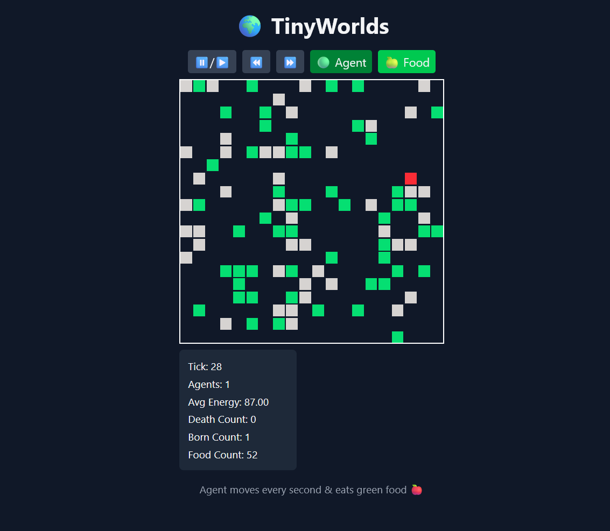

# Tiny Worlds
Simulation World Where Agent Search For Food, Eat, Reproduction

 

## Why This Project Exists
I want to learn Something But a Normal CRUD is boring. So i try to create game like simulation that involve backend.

Manage learn the difference between Channel, Mutex and Atomic which both same handle concurrency be different ideology

Channel -> is Based On Communication Pipe Like Post Office
Mutex -> is Based on Queue, Where it able to change one by one
Atomic -> is more like special CPU instruction allowed them to change value in memory in atomic level at the hardware level

## How to Run

Need to have `make` command. To install `make`, look at google. (Don't Be Lazy, there's an AI you can ask)

And then type `make run`

## Existing Feature

- Debug UI (Pause, Stop/Start, Add New Agent Manual, Add New Food Manual, Speed Up, Slow Down)
- BFS For Path Finding
- Eat, Walk, Reproduction
- Death
- Add Trail For Path Finding (Need A Button To Be Able To Toggle)
- Convert HTTP Pooling into Websocket
- Smooth Animation
- Convert This Mutex To Channel
- Instead Dom Manipulation, change to use canvas manipulation
- Each Agent Have Field Of Vision 
  - This will make agent wander around to find a food

## Current Plan

- Manage to fix the sudden close websocket, now websocket took time to connect, when start a new.
- Add Custom Personality for Each Agent
  - Personality Will Have 3 Trait, Greed (Represent Red), Curiosity (Represent Green), Lazy (Represent Blue) // Max Value 255
    - Each Trait Will Be Use To Color the Agent
    - Each Move Will Unique Depend On Value Combination of 3 Value
      - Each Trait will show how agent approach something
- Since now There Field Of Vision
  - How do i make them think strategize in small window vision, when energy is depleted
  - I do want to make sure the able to remap food location (but sudden realize it too difficult right now)
    - Why Remap? Because since there possible the agent not interest to eat the food (want to explore or wander around) i want them to just remember the location

## Next Future Plan

- Each Agent Able to Expand Conquer other Agent

